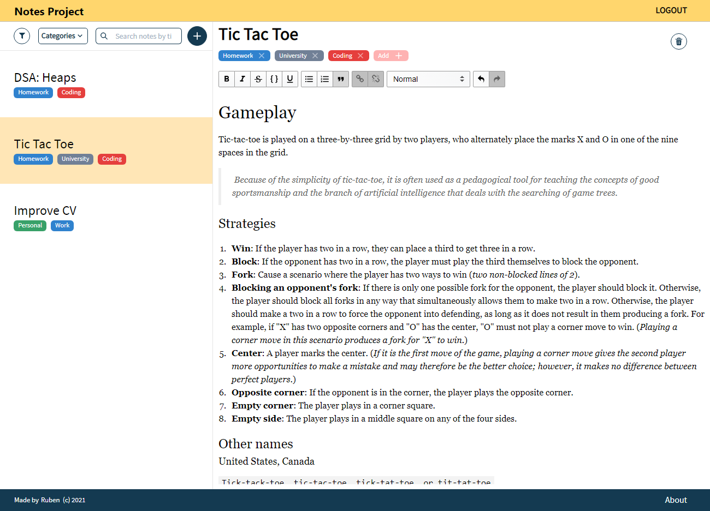

# Notes Project
> [Start taking notes!](https://jovial-engelbart-bf785b.netlify.app/)


[](https://app.netlify.com/sites/jovial-engelbart-bf785b/deploys)

<p align="center">
  <b>Notes-taking app. A fast and open-source alternative!</b>
   
</p>

# Contribution 🤝
All contribution are welcome.\
Please check the [issues](https://github.com/Ruberoni/notes-project/issues) or create one.

# Goals 🚩
- [X] Learn Hapi basics
- [X] Learn Graphql
- [X] Improve my TypeScript
- [X] Improve my React

# Features 🏏
- [X] Write and savenotes as fast as possible.
- [X] Group notes using categories.
- [X] Login with google!
- [ ] (80% ready!) Full responsive.
- [ ] Filter and search notes.

# Dependencies 🧠
## Client side
- Yarn 1.22.x
- Charkra-UI/React ^1.6.6
- React ^17.0.2
- React Google Login ^5.2.2
- React Router Dom ^5.3.0
- Typescript ^4.1.2
- Graphql ^15.5.3
- Apollo Client ^3.4.11

## Server side
- Yarn 1.22.x
- Mysql2 ^2.3.0
- Graphql ^15.5.1
- Typescript ^4.3.5
- Hapi ^20.1.5
- Apollo Server Hapi ^3.1.2
- Type Graphql ^1.1.1
- ts-node ^10.2.0
# Run the app 🚗
## Before all
### Requirements
- Node.js
- Yarn
- You need a Google Client ID for the Google Login feature. Check the [Google's Developer Console](https://console.cloud.google.com/).
- You need a MySQL Server

1. Clone this repo
```
git clone https://github.com/Ruberoni/notes-project.git
```
## Client side

1. Change directory to `client/`
2. Install the modules. Run:
```
yarn
```
3. Setup these enviorment variables:
```
REACT_APP_GOOGLE_CLIENT_ID
REACT_APP_SERVER_URI [optional] - server uri to request the data
```
4. Start the app by running:
```
yarn start
```

## Server side

1. Change directory to `server/`
2. Install the modules by running:
```
yarn
```
3. Setup these enviorment variables:
```
PORT

DB_NAME
DB_USER
DB_HOST
DB_PASSWORD
DB_CACERT [optional] - certificate for a secure MySQL connection. 

DB_TEST_USER
DB_TEST_HOST
DB_TEST_PASSWORD
```
4. Start the server. Run:
```
yarn dev
```
If you have problems starting the server, try copy-pasting the command ran by `yarn dev`
# Attribution 🤼‍♂️
An image from [slidesgo / Freepik](http://www.freepik.com) has been used.
# Contact me! 📞
Email me: [ruben.pardes25@gmail.com](mailto:ruben.pardes25@gmail.com)\
Discord: Ruberoni#8428